# CloudTechoDataAnalysisHiveDCU

## 1. Acquire the top 200,000 posts by viewcount (see notes on Data Acquisition)

The aim of this part 1 is to retrieve 4 csv of 50 000 rows each to finally get the top 200 000 posts represented by rows.

We firstly start to get 50 000 rows above with a magic number in our query. 

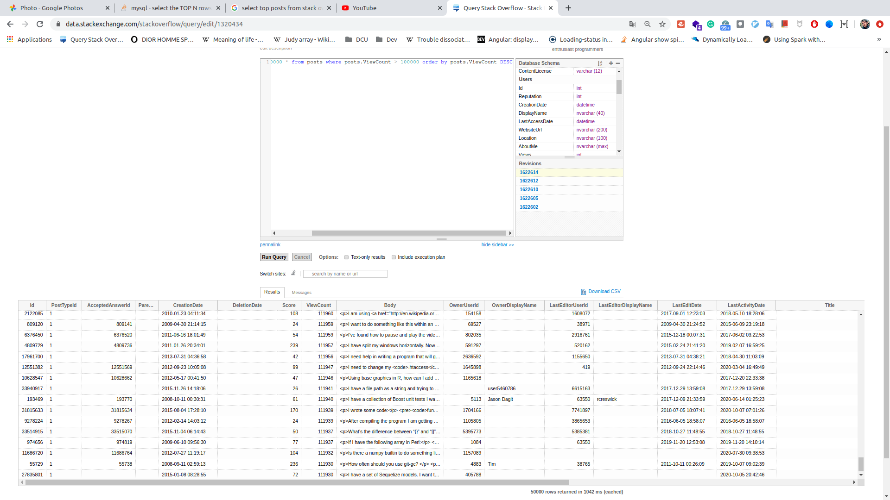

After that, we do 3 other times a request that gets 50 000 rows inferior of the last number got by the previous request.

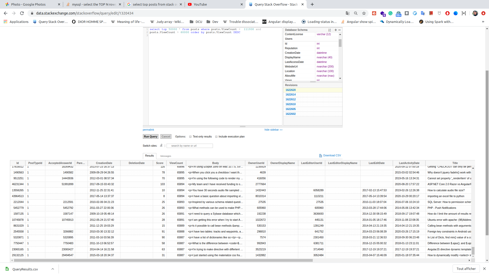

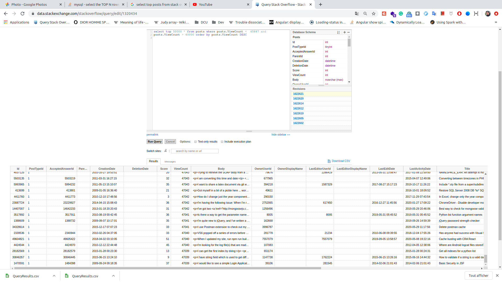

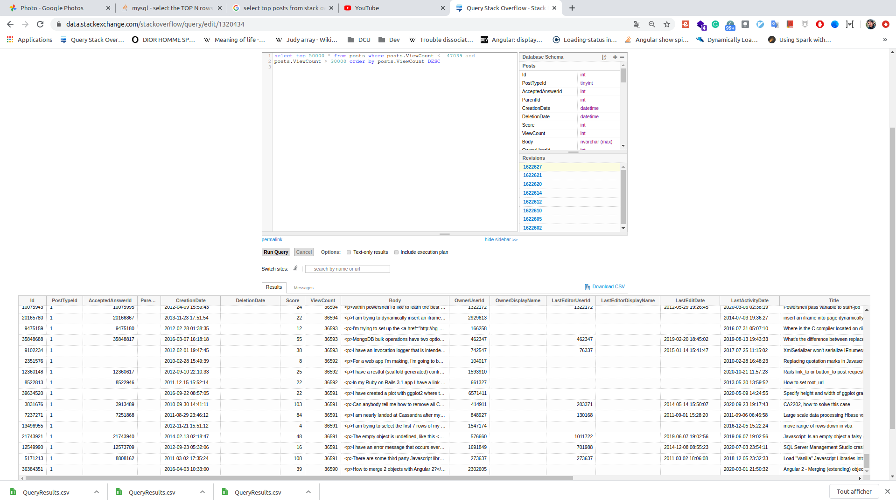

We have finally 4 csv with each 50 000 posts rows 

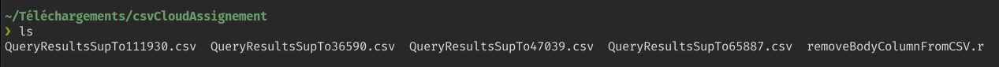

## 2. Using Pig or MapReduce, extract, transform and load the data as applicable

The second and third parts are made with Kotlin language in the same script. Indeed I chose to use for this second task MapReduce with Hive to extract, transform, and load the data as applicable. For the third part I also use Hive to do queries through Kotlin.

Firstly, before executing the script with Kotlin, I implemented a script written in R to remove the body column that is not perfectly formatted. Then, it will be simpler to use these csv with Hive and/or Pig:

Indeed you can see below that we have the four files with an R  script (removeBodyColumnFromCsv).

Below we can see that this script simply removes a column from a csv file.

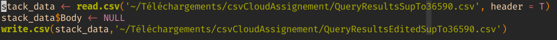

After edited the csv, we have to add these files into an Hadoop Distributed File System (HDFS) that will store these files on the servers inside our Cluster (created with Google Cloud Platform).

Then, we push these files into HDFS  to after be able to use Pig and/or Hive (MapReduce) to load data as applicable.

On the screen below we can see that we create a folder through HDFS, then adding the four csv files to finally print them with the ls command.

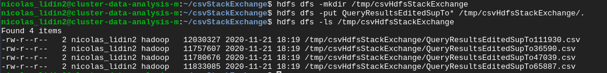

On the screen below we extract all the .csv  and load the data in a new created table with only the column that interests us (we don't add the body column).

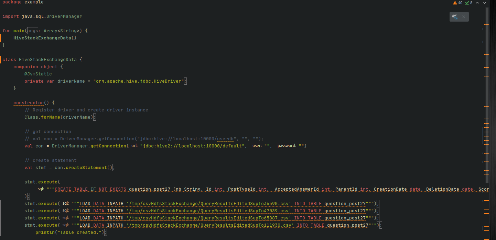

When executing the jar, we can in this the below screen see that the logs show the table is creating (with 200 000 row load with the 4 csv files). 

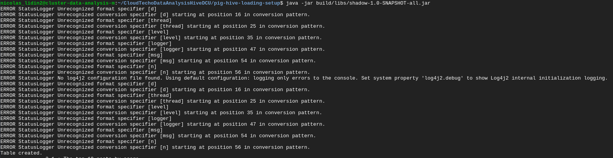

## 3. Using Hive and/or MapReduce, get: 

For this third part, I still use Hive (based on MapReduce) to do all the queries through the table that we just created. We keep doing this part in the same file after loading the data as applicable through `stmt` variable.

### I. The top 10 posts by score

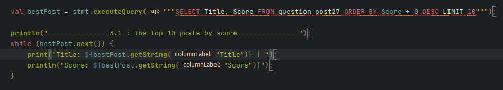

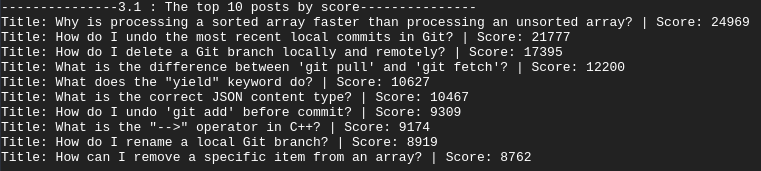

### II. The top 10 users by post score

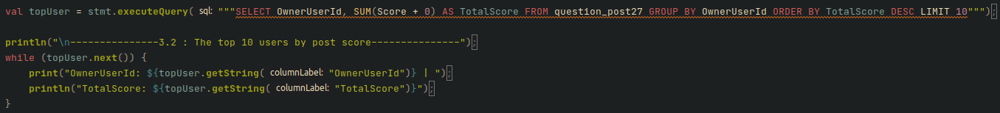

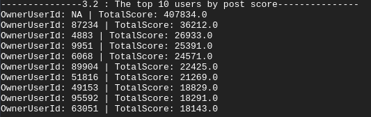

### III. The number of distinct users, who used the word “Hadoop” in one of their posts

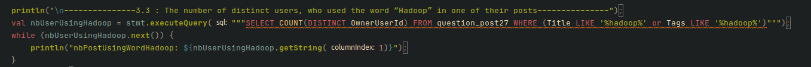

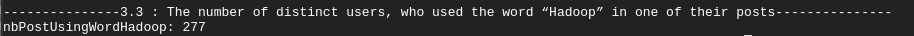

Below we have all the log when executing our Kotlin script. (task 2 and task 3) by doing these two command lines:
`./gradlew build`

`java -jar build/libs/shadow-1.0-SNAPSHOT-all.jar`

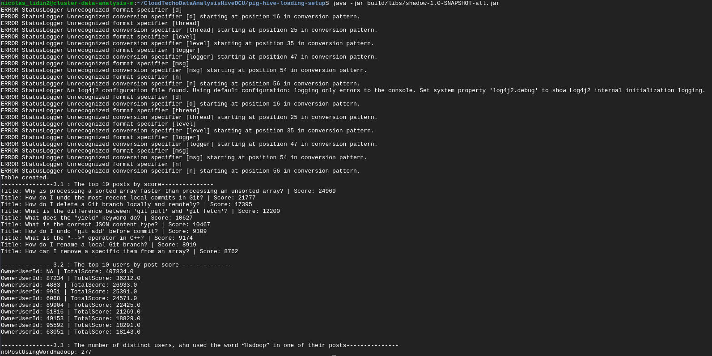